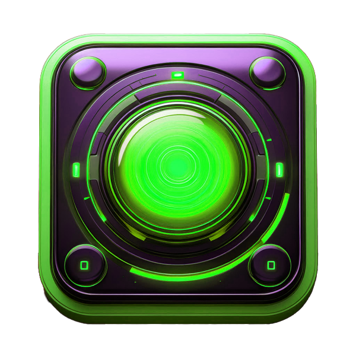

# Last Message

## Overview

Last Message is a prototype safety check-in application designed for individuals living alone or remotely from loved ones. Users periodically confirm their status through a minimal interface; if they fail to check in within a configured time window, the system escalates through warning and grace states before automatically sending a pre-written message to a designated contact.

The project explores a low-friction “dead-man’s switch” interaction model built around time-based state transitions and simple UI feedback (example button assets included in the repo). This project was developed prior to similar concepts gaining mainstream traction (e.g., viral “dead-man’s switch” apps for solo living), and thus represents an early exploration of the problem space.

---

## Concept

The system is centered around a single status indicator:

* 🟢 **Green** — recently checked in
* 🟡 **Yellow / Orange** — warning period
* 🔴 **Red** — grace/danger period

If the user does not check in before the countdown expires, a final message is sent automatically.

---

## Example Flow

1. User configures:

   * their email
   * recipient email
   * message content
   * check-in interval
   * optional warning/grace settings

2. User activates the timer

3. System transitions:

   * Active → Warning → Grace → Expired

4. On expiration:

   * backend triggers automated outbound message (email/SMS prototype)

---

## Tech Stack

* **Frontend:** React, JavaScript, CSS
* **Backend:** Flask (Python)
* **HTTP:** Axios
* **Email:** SMTP / SendGrid (prototype integration)

---

## Architecture Overview

### Frontend

* Located in `last-message-app/`
* React-based form for user configuration
* State-driven UI reflecting timer status
* Beacon-style visual feedback using color states

### Backend

* `Flask_backend.py` (root)

Two backend iterations are included:

1. **Timer Engine Prototype**

   * start / pause / resume / reset timers
   * thread-safe timer management
   * background update loop

2. **App Integration Backend**

   * connects frontend input to timer lifecycle
   * triggers email delivery on expiration
   * enables cross-origin requests (CORS)

---

## Key Features (Prototype Scope)

* Configurable countdown timers
* Warning and grace period logic
* Automated message dispatch on timeout
* Multi-recipient support (conceptual)
* Optional location + usage tracking (early design)

---

## Disclaimer

Sensitive credentials (e.g., API keys) have been removed from this repository. Environment variables should be used for any required secrets.
